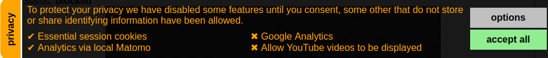

# New Zealand Privacy Act 2020 - User Opt-In Banner

A simple JavaScript library to handle requesting consent from visitors to allow analytics and third party content that may impact their privacy.

Started in November 2020 by [Tony Cooper](mailto:tony@balsa.co.nz) of [Balsa Limited](https://balsa.co.nz) (New Zealand)

This project is is an MIT-licensed open source project and completely free to use.



&nbsp;
## Note
The New Zealand Privacy act of 2020 does not limited your obligations to notifying visitors you are using cookies. You need consent from the visitor before exposing them to anything that might impact their right to privacy.

I strongly suggest to get legal advise to craft a page explaining what information you collect, how it is stored and who you share it with.

A good place to start reading about the changes is here:<br/>
https://privacy.org.nz/privacy-act-2020/privacy-act-2020/

&nbsp;
## Installing
Copy the opt-in folder into your web site
### Add to HTML header
* ```<script src="/opt-in/opt-in.js"></script>```
* ```<link rel="StyleSheet" type="text/css" href="/opt-in/opt-in.css"/>```

## Configuring 
### Add to pages or common js file:
```JavaScript
<script>
  //setup global object OptIn 
  OptIn.readMoreUrl = 'https://yoursite.com/privacy.html';
  //more ... settings  

  //Create OptIn types for the viewer to selected from
  var optin_Analytics = new OptInType(
    'analyticsName', 'Short Description', 
    function(){
      //analytics tracking JS code
      //this code is only run after consent is provided
    } 
  );

  //Add more OptInType here

  OptIn.addDraw(); //Add a draw/banner which prompts the user for consent
</script>
```

----

## test.html
A simple test page with JS to initialise the opt-in system has been provided. If you are using a Linux desktop with PHP install the runTest\.sh script can be used to start a simple web server and open test.html in your web browser.

---

## opt-in/opt-in.css
This file contains the default CSS for the draw and dialogue. Overriding these styles can be done by adding entries in the site main CSS prefixed with the body selector.

For example, if you wanted to change the font colour of the dialogue:
```CSS
body .OptIn_ConsentForm{
  color: silver;
}
```
See **test.css** for an example of this.


## OptIn_Changed event
This JS registers an event that is triggered when the setting are changed. This can be hooked into as follows:
```JavaScript
<script>
  addEventListener('OptIn_Changed', function(){
    //Your code to handle the change of user consent
  });
</script>
```

## OptIn object
The OptIn JS object contains the configuration and helper methods.

&nbsp;

|property|default|comment|
|:--|:--:|:--|
|isAllowed|'✔'|HTML to be displayed in the draw if the option is active|
|isNotAllowed|'✖'|HTML to be displayed in the draw if the option is block|
|thisSessionOnly|false|If true, the options selected will be forgotten as the session ends|
|readMoreUrl|false|Should be set to a page discribing your privacy pollicy|
|minDrawWidthInEm|32|The screen width at which the draw will no longer pop out (to handle mobile users)|
|triggerFirstVisitPopup|true|Popout the draw or dialogue auto matically if no options has been saved|
|shortHTML|'...'|HTML to be displayed at the top of the draw or dialogue|
|items|[]|An array of OptInTypes created|

&nbsp;

|method|comment|
|:--|:--|
|findItemByIdent(ident)|returns the OptInType object matching the ident or null|
|getConsent(ident)|returns the consent setting for the given ident as a boolean or null if it has never been set.|
|setConsent(ident,&nbsp;value)|Sets the consent for the given ident where value is a boolean|
|clearConsent(ident)|Deletes the consent setting for the given ident|
|acceptAll()|Sets all OptInType as being consented to|
|addDraw()|Adds a draw /banner to the page if not already existing|
|closeDraw()|Close the draw if open|
|openDraw()|Open the draw if closed|

&nbsp;
## OptInType(ident, caption, onAllowed)
A function which creates an object describing the issue we'll need to ask the view consent for.

&nbsp;

|property|default|comment|
|:--|:--:|:--|
|ident|''|A unique name identifying this consent type|
|caption|''|Short text describing what we are asking consent for|
|isRequired|false|This option is required/essential from the running of the web site| 
|defaultConsent|false|Default consent setting|
|onAllowed|function|The function to be executed when consent is given.|
|onDisallowed|null|The function to be executed when consent is revoked|

&nbsp;

## Road Map
* Update the draw with more option about where and how it is displayed
* Create better documentation and examples